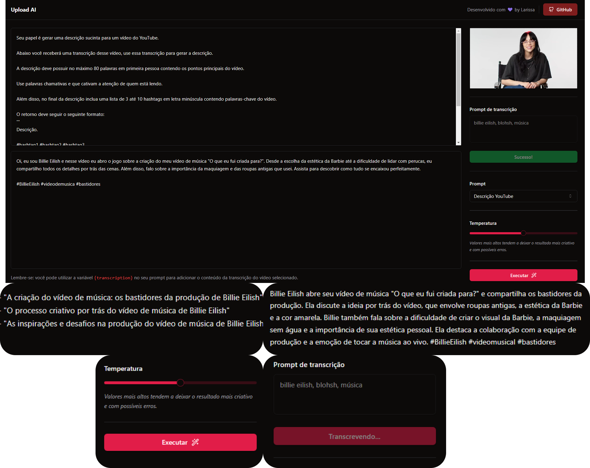

<h1 align="center"> API-AI-DESCRIPTION</h1>

Projeto criado no evento sobre Inteligência Artificial na Trilha Mastery da RocketSeat.

  

## 💻 Projeto

API-AI-DESCRIPTION é uma aplicação web para criar Títulos e Descrições de vídeos utilizando inteligência artificial, sucinta para um vídeo do YouTube.

Além disso, no final da descrição é incluida uma lista de 3 até 10 hashtags contendo palavras-chave do vídeo. 

Aplicação perfeita para quem é criador de conteúdo em vídeos. 

## 🚀 Tecnologias

Esse projeto foi desenvolvido com as seguintes tecnologias:

- HTML e CSS
- JavaScript
- Inteligência Artificial
- Git e Github
- Figma

------

<footer>Feito com ♥ by Larissa</footer>
=======